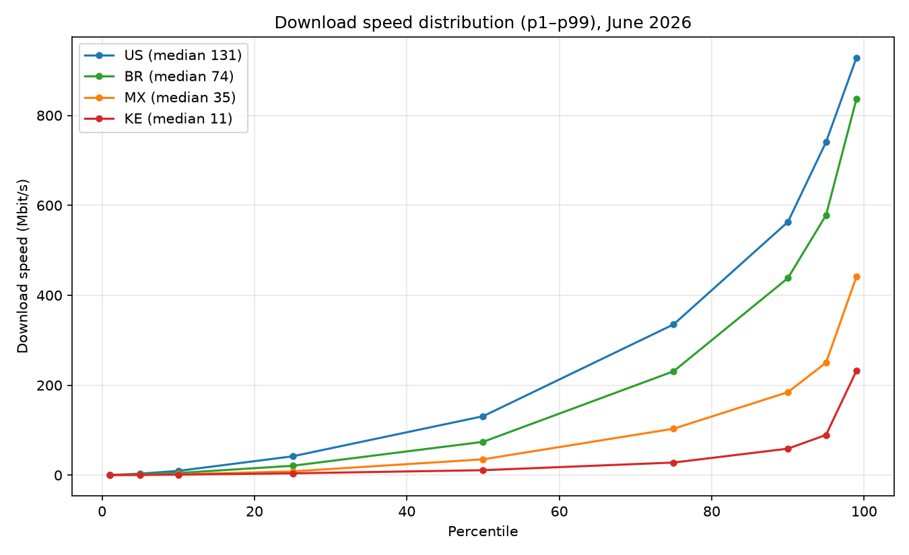

<!-- _class: lead -->
# M-Lab Monthly Stats

## What gets measured, how to read it, and how **you** can explore it — today.

A 5-minute walk-through of the dataset using Jupyter Notebooks

Jonah Duckles · <jonah@measurementlab.net> · M-Lab

---

<!-- _class: lead -->
## Monthly Stats Data

Every month, **millions of people** run an open speed test against
[M-Lab](https://www.measurementlab.net/).

We take **every** one of those tests and statistically summarize them in a **small, pre-computed
file you can easily download**.

The notebooks in this tutorial turn that file into answers about any country,
region, city, or provider in the world.

---

## Where the data come from

- **NDT** — the Network Diagnostic Tool — the key tool in the open speed test which M-Lab runs.
- **Millions** of tests every month, from real user devices worldwide.
- **BigQuery** stores the raw rows; the full archive is **petabytes** of measurements.

The **Monthly Stats** dataset is M-Lab's curated, summarized view of all that:
- **2009 → present**, every month
- **240 countries**, plus regions, cities, and providers
- **one small Parquet file per month, per geography** (a few MB each)

> Instead of querying petabytes of raw rows, each month you download one small
> file with pre-computed percentile values — for each metric, geography, and month.

---

## What's inside each file

| Metric | Column prefix | Unit | Better |
|---|---|---|---|
| Download throughput | `download_p*` | Mbit/s | ↑ higher |
| Upload throughput | `upload_p*` | Mbit/s | ↑ higher |
| Latency (min RTT) | `latency_p*` | ms | ↓ lower |
| Packet loss rate | `loss_p*` | fraction | ↓ lower |

_Where `p*` is the percentile one of `['p1', 'p5', 'p10', 'p25', 'p50', 'p75', 'p90', 'p95', 'p99']` allowing you to explore the distribution and its skew_

---

## Percentiles: line everyone up

**Line all the tests in a month up, slowest → fastest:**

- **p50** — the median, the test in the exact middle — the typical user's experience
- **p95** — the fastest connections (or lowest loss / latency)
- **p1** — near the very back (slowest, highest loss / latency)

This shows us the way the metric (throughput, latency, loss) varies across the tests.

> **A wide p50→p95 gap shows how different experiences can be** in the aggregation area (country, subdivision, city, ASN / ISP)

---

## The splits: "one row per what" is the only difference

| Slice | One row per… |
|---|---|
| `downloads_by_country` / `uploads_by_country` | country |
| `downloads_by_country_subdivision1` | state / province |
| `downloads_by_country_city` | city |
| `downloads_by_country_asn` | provider (ASN) |

Every slice keeps the **same four metrics** across their percentiles — only the
geography changes.

---

<!-- _class: lead -->
## What the numbers look like — June 2026, country medians

**Download p50, Mbit/s** (240 countries on file)

| 🇺🇸 US | 🇧🇷 BR | 🇲🇽 MX | 🇰🇪 KE |
|---|---|---|---|
| **131** | 74 | 35 | 11 |

<!-- June 2026 medians; see the percentile-curve plot on the next slide -->

**What shape means here**

- A **median** is one point — the typical user.
- The **distribution** is the whole curve: p5, p25, p50, p75, p95, p99.
- The notebook 01 **percentile sweep** shows whether a ranking
  survives at p95 vs p50 — often it does not.

---

<!-- _class: lead -->
## The shape behind the medians — percentile curves

Each line is one country's **full distribution** (p1 → p99), June 2026. The
**median** is just the middle point — the **curve is the story**: where it sits
low and flat, that is where most users actually are; a stretch at the top is a
minority running far faster. Notebook 01 draws these curves for any country,
any metric, any month.

---

## The four notebooks

| | Question it answers |
|---|---|
| **00 · introduction & catalog** | What are these data, and how to load them? |
| **01 · country explorer** | How do I read a country's distribution shape? |
| **02 · the splits** | Where does it vary: countries, regions, cities, providers? |
| **03 · multiple months** | How do measurements change over months? |

Each is **self-contained** 

---

## Try it right now — MyBinder

Click a notebook — it launches in your browser in seconds. No local install.

| Notebook | Binder |
|---|---|
| 00 · introduction & catalog |  |
| 01 · country explorer |  |
| 02 · the splits |  |
| 03 · multiple months |  |

**Your country.** Look up your own — median, shape, regions, and whether it improves.

<!-- _class: lead -->
## Recap

- **Percentiles, not averages** — and the shape of the distribution can be used to ask many questions of the data.
- **Four metrics** × **the same slices** — country, region, city, Internet provider (ASN).
- **One loading pattern**, four notebooks, zero installs: launch any in MyBinder.

**Thanks! Questions? Hands-on time — open a notebook and explore!**